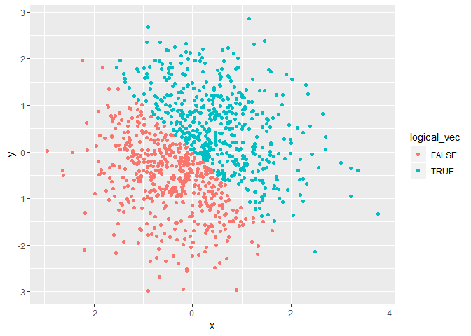
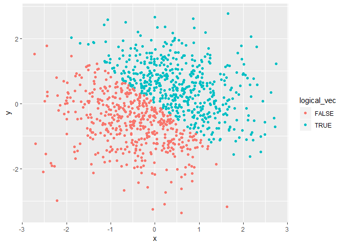

p8105\_hw1\_smi2112
================

Question 1
==========

Creating the data frame:

``` r
library(tidyverse)
```

    ## -- Attaching packages ---------------------------------------------------------------------------------------------------- tidyverse 1.2.1 --

    ## v ggplot2 3.0.0     v purrr   0.2.5
    ## v tibble  1.4.2     v dplyr   0.7.6
    ## v tidyr   0.8.1     v stringr 1.3.1
    ## v readr   1.1.1     v forcats 0.3.0

    ## -- Conflicts ------------------------------------------------------------------------------------------------------- tidyverse_conflicts() --
    ## x dplyr::filter() masks stats::filter()
    ## x dplyr::lag()    masks stats::lag()

``` r
question_one_df <- tibble(
    random_samp = runif(10, min = 0, max = 5),
    logical_vec = random_samp > 2,
    char_vec = c("one", "two", "three", "four", "five", "six", "seven", "eight", "nine", "ten"),
    factor_vec = factor(c("yes", "yes", "yes", "yes", "yes", "no",  "no", "no", "no", "no"))
)
```

Attempting to take the mean of each variable in the data frame:

``` r
mean(question_one_df$random_samp)
```

    ## [1] 2.256764

``` r
mean(question_one_df$logical_vec)
```

    ## [1] 0.5

``` r
mean(question_one_df$char_vec)
```

    ## Warning in mean.default(question_one_df$char_vec): argument is not numeric
    ## or logical: returning NA

    ## [1] NA

``` r
mean(question_one_df$factor_vec)
```

    ## Warning in mean.default(question_one_df$factor_vec): argument is not
    ## numeric or logical: returning NA

    ## [1] NA

The mean of the random sample is 2.256764, and the mean of the logical vector is 0.5.

The mean of the random sample works because the vector is made up of numbers generated by the runif() function, and r is able to take the mean of numbers. The mean of the logical vector also works because the logical vector codes TRUE statements as 1 and FALSE statements as 0. The mean of the 1's and 0's is taken.

The mean of the character vector and the factor vector do not work becuase they are not numbers.

Question 2
==========

Creating the data frame:

``` r
question_two_df <- tibble(
  x = rnorm(1000),
  y = rnorm(1000),
  logical_vec = x + y > 0,
  numeric_vec = as.numeric(logical_vec),
  factor_vec = as.factor(logical_vec)
)
```

The size of the dataset is 1000, 5. The mean of x is 0.0445512 and the median of x is 0.0266316. The proportion of cases for which the logical vector is true is 0.506.

Creating the first scatterplot with color points using the logical variable, and exporting to the project directory:

``` r
ggplot(question_two_df, aes(x = x, y = y, color = logical_vec)) + geom_point()
```



``` r
ggsave("hw1_scatterplot.pdf")
```

    ## Saving 7 x 5 in image

Creating the second scatterplot with color points using the numeric variable:

``` r
ggplot(question_two_df, aes(x = x, y = y, color = numeric_vec)) + geom_point()
```



Creating the third scatterplot with color points using the factor variable:

``` r
ggplot(question_two_df, aes(x = x, y = y, color = factor_vec)) + geom_point()
```


Commenting on the color scales of each scatterplot:

The color scale in the first scatterplot is binary, which makes sense becuase the logical vector only has two options (TRUE of FALSE). The color scale in the second scatterplot is continuous on a scale from 0 to 1, which makes sense because we are coloring a numeric variable that has a minimum of 0 and a maximum of 1. However, because the values will either be 0 or 1, we only see the extreme ends of the color scale (the color that corresponds with 0 and the color scale that corresponds with 1). The color scale in the third scatterplot is binary again, which makes sense becuase there are only two options again, TRUE or FALSE.
